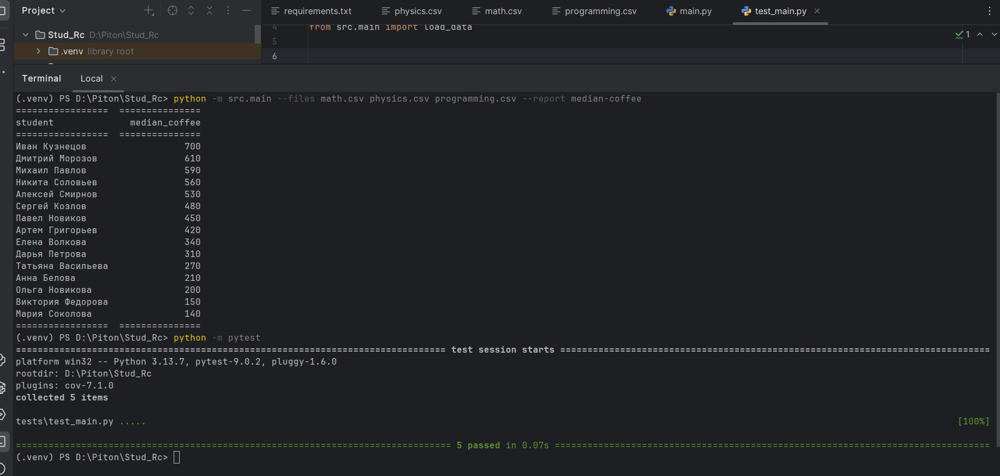

# Coffee Consumption Report

Скрипт для расчета медианных трат студентов на кофе.

### Ключевые особенности:
* **Архитектура:** Реализован паттерн (Strategy) с реестром отчетов. Это позволяет добавлять новую логику.
* **Производительность:** Чтение файлов реализовано через итератор `csv.DictReader`,позволяет обрабатывать файлы большого объема.
* **Тесты:** Логика расчетов и работа с аргументами полностью покрыта Unit-тестами (pytest).

### Примеры запуска:
```bash
python -m src.main --files math.csv physics.csv --report median-coffee
